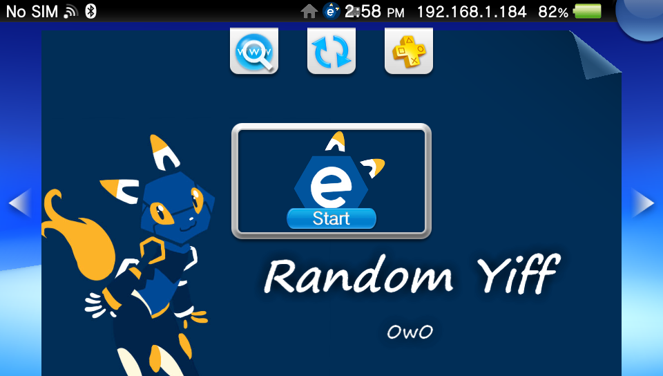

# Random Yiff
i did it. It's RandomHentai, except [e621](https://e621.net).

That's really it. Do I need to say any more?

I have absolutely no idea how to code lua. This took way longer than expected, and the code is probably fuckin spaghetti. I am aware that occasionally no image shows up. If someone could give advice that would be nice, but for now, you can press cross or down to just load a new one.

Uses [e621](https://e621.net) as a source.

## Controls
**L Trigger/R Trigger** - Save current image (By ID)

**Up/Triangle** - Auto next timer toggle/reset

**Right/Circle** - Increase timer duration (up to 60 seconds)

**Left/Square** - Decrease timer duration (down to 5 seconds)

**Down/X** - Next image
